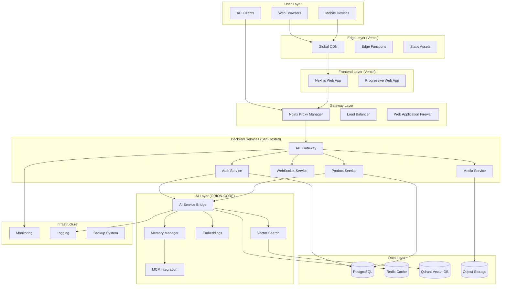
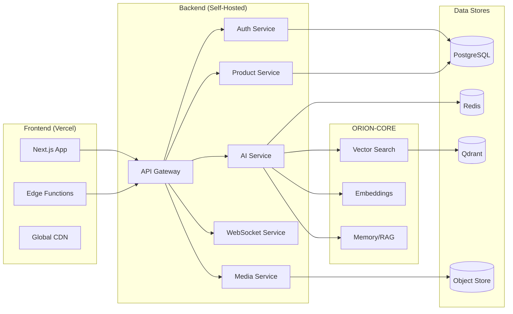
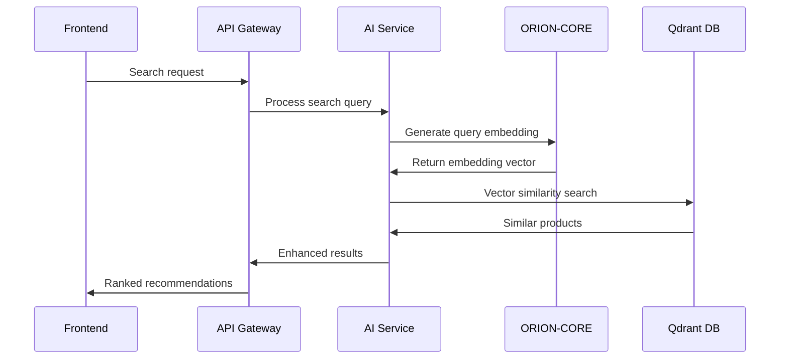
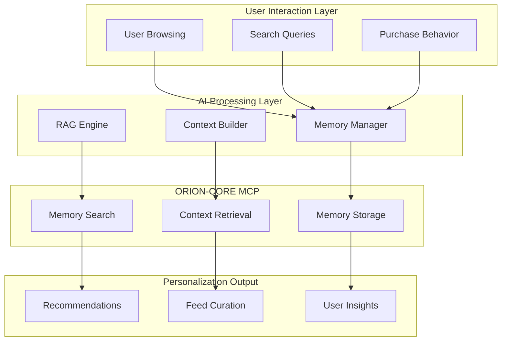
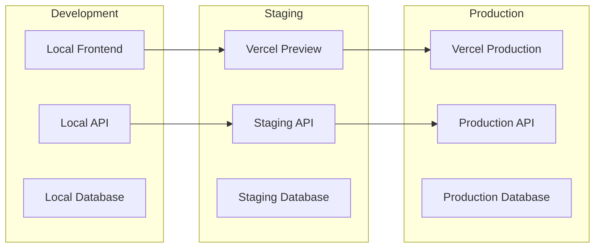
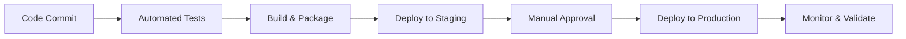

# System Architecture Document (SAD)
## AI-Powered Art Marketplace with ORION-CORE Integration

**Document Version**: 1.0
**Date**: $(date)
**Project**: AI-Marketplace
**Architect**: Development Team

---

## 1. Executive Summary

### 1.1 Architecture Overview
The AI-Marketplace employs a hybrid cloud architecture combining Vercel's global edge network for frontend delivery with self-hosted backend services for control and ORION-CORE integration for advanced AI capabilities.

### 1.2 Key Architectural Decisions
- **Hybrid Deployment**: Vercel frontend + self-hosted backend for optimal performance and control
- **Microservices**: Modular backend services for scalability and maintainability
- **AI-First Design**: Deep ORION-CORE integration with MCP for extended memory and RAG
- **Real-time Architecture**: WebSocket-based live updates and streaming capabilities
- **Motion-Rich Frontend**: Performance-optimized animations with Framer Motion and GSAP

---

## 2. System Context

### 2.1 System Landscape



### 2.2 External Dependencies
- **Vercel Platform**: Frontend hosting and global CDN
- **ORION-CORE Services**: AI capabilities (vector search, embeddings, memory)
- **Payment Processors**: Stripe, PayPal for transactions
- **Object Storage**: AWS S3 or compatible for media files
- **Monitoring**: Prometheus, Grafana for observability

---

## 3. Architectural Principles

### 3.1 Design Principles
1. **AI-First**: Every feature considers AI enhancement opportunities
2. **Performance-Centric**: Sub-second response times for all user interactions
3. **Scalability**: Horizontal scaling for all components
4. **Resilience**: Graceful degradation when services are unavailable
5. **Security**: Zero-trust architecture with defense in depth
6. **User Experience**: Motion-rich, responsive, accessible interfaces

### 3.2 Technology Choices

#### Frontend Stack
- **Next.js 14**: React framework with App Router for optimal performance
- **TypeScript**: Type safety and developer experience
- **Framer Motion**: Declarative animations and gestures
- **GSAP**: Complex timeline animations
- **Tailwind CSS**: Utility-first styling with custom design system

#### Backend Stack
- **Node.js**: JavaScript runtime for unified development
- **Express.js**: Web framework for API services
- **TypeScript**: Type safety across the entire stack
- **Socket.io**: Real-time WebSocket communication
- **Sharp**: High-performance image processing

#### AI & Data Stack
- **ORION-CORE**: Vector search, embeddings, memory management
- **PostgreSQL**: Primary relational database
- **Redis**: Caching and session storage
- **Qdrant**: Vector database for similarity search
- **MinIO**: S3-compatible object storage

---

## 4. System Architecture

### 4.1 High-Level Architecture



### 4.2 Component Interactions

#### 4.2.1 User Request Flow
1. **Frontend**: User interaction triggers API call
2. **CDN**: Request routed through Vercel's global edge network
3. **Gateway**: Nginx Proxy Manager routes to appropriate backend service
4. **Authentication**: JWT token validation and user context
5. **Service Processing**: Business logic execution with AI enhancement
6. **Data Access**: Database queries and caching
7. **AI Enhancement**: ORION-CORE processing for intelligent features
8. **Response**: JSON response with real-time updates via WebSocket

#### 4.2.2 AI Processing Flow
1. **Content Ingestion**: New artwork uploaded to system
2. **Embedding Generation**: ORION-CORE creates text and image embeddings
3. **Vector Storage**: Embeddings stored in Qdrant for similarity search
4. **Memory Storage**: User interactions stored via MCP for personalization
5. **Real-time Analysis**: Content analyzed for trends and quality
6. **Recommendation Generation**: RAG-powered suggestions created
7. **Feed Curation**: AI-enhanced content ordering and filtering

---

## 5. Detailed Component Design

### 5.1 Frontend Architecture (Vercel)

#### 5.1.1 Next.js Application Structure
```
apps/web/
├── app/                          # App Router (Next.js 14)
│   ├── (dashboard)/             # Dashboard layout group
│   │   ├── feed/                # Main content feed
│   │   ├── search/              # AI-powered search
│   │   └── profile/             # User profiles
│   ├── (marketplace)/           # Marketplace layout
│   │   ├── products/            # Product listings
│   │   ├── artists/             # Artist profiles
│   │   └── collections/         # Curated collections
│   ├── api/                     # API routes (middleware)
│   └── globals.css              # Global styles
├── components/                  # React components
│   ├── feed/                    # Feed-specific components
│   ├── motion/                  # Animation components
│   ├── ai-features/             # ORION-powered features
│   └── ui/                      # Design system components
├── hooks/                       # Custom React hooks
├── lib/                         # Utility libraries
├── store/                       # State management (Zustand)
└── types/                       # TypeScript definitions
```

#### 5.1.2 State Management Strategy
- **Zustand**: Global state for user preferences, UI state
- **TanStack Query**: Server state management with caching
- **React Context**: Theme, authentication context
- **Local Storage**: Persistent user preferences

#### 5.1.3 Performance Optimizations
- **Code Splitting**: Route-based and component-based splitting
- **Image Optimization**: Next.js Image component with WebP/AVIF
- **Bundle Analysis**: Webpack Bundle Analyzer for optimization
- **Edge Functions**: Server-side processing at edge locations

### 5.2 Backend Services Architecture

#### 5.2.1 API Gateway Service
```javascript
// Gateway responsibilities
- Request routing and load balancing
- Authentication and authorization
- Rate limiting and DDoS protection
- Request/response transformation
- API versioning and documentation
- Metrics collection and monitoring
```

#### 5.2.2 Microservices Design

##### Authentication Service
- **JWT token management** with refresh token rotation
- **Multi-factor authentication** with TOTP/SMS
- **Social login integration** (Google, Apple, Twitter)
- **Role-based access control** with permission matrices
- **Session management** with Redis-backed storage

##### Product Service
- **Product CRUD operations** with version control
- **Category and tag management** with hierarchical structure
- **Inventory tracking** with real-time updates
- **Price management** with dynamic pricing support
- **Review and rating system** with moderation

##### Media Service
- **Image upload and processing** with Sharp
- **Video transcoding** with FFmpeg
- **CDN integration** for global distribution
- **Image optimization** with multiple formats
- **Metadata extraction** for AI analysis

##### WebSocket Service
- **Real-time notifications** with room-based broadcasting
- **Live chat functionality** for artist streams
- **Collaborative features** for shared experiences
- **Connection management** with reconnection logic
- **Message queuing** for reliable delivery

#### 5.2.3 AI Service Bridge
```javascript
// AI Service Architecture
class AIServiceBridge {
  constructor() {
    this.vectorSearch = new OrionVectorSearch();
    this.embeddings = new OrionEmbeddings();
    this.memoryManager = new OrionMemoryManager();
  }

  // Main AI operations
  async enhanceProduct(product) {
    // Generate embeddings for search
    const embeddings = await this.embeddings.generateProductEmbedding(product);

    // Store for vector search
    await this.vectorSearch.storeProduct(product, embeddings);

    // Update memory for personalization
    await this.memoryManager.storeProductInfo(product);

    return { product, embeddings, stored: true };
  }

  async getPersonalizedRecommendations(userId, context) {
    // Use RAG for contextual recommendations
    const userContext = await this.memoryManager.getUserContext(userId);
    const recommendations = await this.vectorSearch.findSimilar(userContext);

    return this.rankRecommendations(recommendations, userContext);
  }
}
```

### 5.3 Data Architecture

#### 5.3.1 Database Design

##### PostgreSQL Schema
```sql
-- Core entities
CREATE TABLE users (
    id UUID PRIMARY KEY DEFAULT gen_random_uuid(),
    email VARCHAR(255) UNIQUE NOT NULL,
    password_hash VARCHAR(255),
    profile JSONB,
    preferences JSONB,
    created_at TIMESTAMP DEFAULT NOW(),
    updated_at TIMESTAMP DEFAULT NOW()
);

CREATE TABLE artists (
    id UUID PRIMARY KEY DEFAULT gen_random_uuid(),
    user_id UUID REFERENCES users(id),
    bio TEXT,
    style_tags TEXT[],
    portfolio_url VARCHAR(255),
    verified BOOLEAN DEFAULT FALSE,
    created_at TIMESTAMP DEFAULT NOW()
);

CREATE TABLE products (
    id UUID PRIMARY KEY DEFAULT gen_random_uuid(),
    artist_id UUID REFERENCES artists(id),
    title VARCHAR(255) NOT NULL,
    description TEXT,
    category VARCHAR(100),
    style VARCHAR(100),
    price DECIMAL(10,2),
    images JSONB,
    metadata JSONB,
    embedding_id VARCHAR(255),
    created_at TIMESTAMP DEFAULT NOW(),
    updated_at TIMESTAMP DEFAULT NOW()
);

CREATE TABLE interactions (
    id UUID PRIMARY KEY DEFAULT gen_random_uuid(),
    user_id UUID REFERENCES users(id),
    product_id UUID REFERENCES products(id),
    interaction_type VARCHAR(50),
    context JSONB,
    timestamp TIMESTAMP DEFAULT NOW()
);

-- Search and analytics
CREATE TABLE search_queries (
    id UUID PRIMARY KEY DEFAULT gen_random_uuid(),
    user_id UUID REFERENCES users(id),
    query TEXT,
    filters JSONB,
    results_count INTEGER,
    timestamp TIMESTAMP DEFAULT NOW()
);

-- AI-enhanced tables
CREATE TABLE recommendations (
    id UUID PRIMARY KEY DEFAULT gen_random_uuid(),
    user_id UUID REFERENCES users(id),
    product_id UUID REFERENCES products(id),
    score DECIMAL(3,2),
    reasoning JSONB,
    created_at TIMESTAMP DEFAULT NOW()
);
```

##### Vector Database (Qdrant)
```javascript
// Vector collections structure
const vectorCollections = {
  products: {
    dimension: 768,
    distance: 'Cosine',
    indexes: ['category', 'style', 'artist_id'],
    payloads: ['product_id', 'metadata', 'timestamp']
  },
  users: {
    dimension: 384,
    distance: 'Cosine',
    indexes: ['user_id', 'preferences'],
    payloads: ['user_context', 'behavior_patterns']
  }
};
```

#### 5.3.2 Caching Strategy

##### Redis Cache Layers
```javascript
// Multi-layer caching strategy
const cacheConfig = {
  L1: { // Hot data
    ttl: 300,     // 5 minutes
    keys: ['user_session', 'active_products', 'live_recommendations']
  },
  L2: { // Warm data
    ttl: 3600,    // 1 hour
    keys: ['product_details', 'artist_profiles', 'category_data']
  },
  L3: { // Cold data
    ttl: 86400,   // 24 hours
    keys: ['search_results', 'recommendation_models', 'analytics_data']
  }
};
```

---

## 6. AI Integration Architecture

### 6.1 ORION-CORE Integration Patterns

#### 6.1.1 Vector Search Flow


#### 6.1.2 Memory & RAG Architecture


### 6.2 Real-time AI Processing

#### 6.2.1 Live Content Analysis
```javascript
// Real-time AI processing pipeline
class LiveAIProcessor {
  async processUserAction(userId, action, context) {
    // Immediate processing
    const embedding = await this.generateActionEmbedding(action, context);

    // Store in MCP memory
    await this.memoryManager.storeInteraction(userId, action, {
      embedding,
      context,
      timestamp: Date.now()
    });

    // Update user profile in real-time
    const updatedProfile = await this.updateUserProfile(userId, embedding);

    // Trigger recommendation refresh
    this.triggerRecommendationUpdate(userId, updatedProfile);

    return { processed: true, profileUpdated: true };
  }
}
```

---

## 7. Security Architecture

### 7.1 Security Layers

#### 7.1.1 Network Security
- **WAF (Web Application Firewall)**: DDoS protection and attack filtering
- **TLS 1.3**: End-to-end encryption for all communications
- **VPN Access**: Secure administrative access to backend systems
- **Network Segmentation**: Isolated networks for different service tiers

#### 7.1.2 Application Security
- **JWT Tokens**: Stateless authentication with refresh rotation
- **RBAC**: Role-based access control with fine-grained permissions
- **Input Validation**: Comprehensive sanitization and validation
- **Rate Limiting**: Per-user and per-IP request throttling

#### 7.1.3 Data Security
- **Encryption at Rest**: AES-256 for sensitive data storage
- **Data Anonymization**: PII removal for analytics and AI training
- **Audit Logging**: Comprehensive access and modification logging
- **Backup Encryption**: Encrypted backups with key rotation

### 7.2 AI Security Considerations

#### 7.2.1 Model Security
- **Input Sanitization**: Prevent prompt injection attacks
- **Output Filtering**: Content moderation for AI-generated responses
- **Model Isolation**: Sandboxed execution environments
- **Version Control**: Secure model deployment and rollback

#### 7.2.2 Privacy Protection
- **Differential Privacy**: User data protection in AI training
- **Federated Learning**: Decentralized model improvement
- **Data Minimization**: Collect only necessary user information
- **Right to Deletion**: GDPR-compliant data removal

---

## 8. Performance & Scalability

### 8.1 Performance Targets

#### 8.1.1 Response Time Targets
| Component | Target | Measurement |
|-----------|--------|-------------|
| Frontend Load | <2s | First Contentful Paint |
| API Response | <500ms | 95th percentile |
| Search Results | <3s | Complex AI queries |
| Real-time Updates | <100ms | WebSocket latency |
| Image Load | <1s | Optimized images |

#### 8.1.2 Throughput Targets
| Service | Target | Peak Capacity |
|---------|--------|---------------|
| API Gateway | 1000 RPS | 5000 RPS |
| Database | 5000 QPS | 20000 QPS |
| Vector Search | 100 QPS | 500 QPS |
| WebSocket | 10000 concurrent | 50000 concurrent |

### 8.2 Scaling Strategies

#### 8.2.1 Horizontal Scaling
- **Microservices**: Independent scaling of individual services
- **Load Balancing**: Round-robin and least-connection algorithms
- **Auto-scaling**: CPU and memory-based scaling triggers
- **Database Sharding**: Horizontal partitioning for large datasets

#### 8.2.2 Caching Strategies
- **CDN Caching**: Global edge caching for static assets
- **Application Caching**: Redis-based multi-layer caching
- **Database Caching**: Query result caching with invalidation
- **AI Model Caching**: Embedding and recommendation caching

---

## 9. Deployment Architecture

### 9.1 Environment Strategy

#### 9.1.1 Environment Tiers


#### 9.1.2 Infrastructure as Code
```yaml
# Example Docker Compose for development
version: '3.8'
services:
  api-gateway:
    build: ./backend/api-gateway
    ports: ["3001:3001"]
    environment:
      - DATABASE_URL=${DATABASE_URL}
      - REDIS_URL=${REDIS_URL}
      - ORION_API_BASE=${ORION_API_BASE}
    depends_on: [postgres, redis]

  ai-service:
    build: ./backend/ai-service
    ports: ["3003:3003"]
    environment:
      - ORION_VECTOR_API_BASE=${ORION_VECTOR_API_BASE}
      - ORION_MCP_URL=${ORION_MCP_URL}
    depends_on: [redis, qdrant]

  postgres:
    image: postgres:15
    environment:
      POSTGRES_DB: ai_marketplace
      POSTGRES_USER: ${DB_USER}
      POSTGRES_PASSWORD: ${DB_PASSWORD}
    volumes: ["postgres_data:/var/lib/postgresql/data"]

  redis:
    image: redis:7-alpine
    ports: ["6379:6379"]

  qdrant:
    image: qdrant/qdrant:latest
    ports: ["6333:6333"]
    volumes: ["qdrant_data:/qdrant/storage"]
```

### 9.2 CI/CD Pipeline

#### 9.2.1 Deployment Flow


#### 9.2.2 Rollback Strategy
- **Blue-Green Deployment**: Zero-downtime deployments
- **Feature Flags**: Gradual feature rollout and quick rollback
- **Database Migrations**: Reversible schema changes
- **Monitoring Alerts**: Automatic rollback triggers

---

## 10. Monitoring & Observability

### 10.1 Monitoring Stack

#### 10.1.1 Metrics Collection
- **Application Metrics**: Custom business metrics with Prometheus
- **Infrastructure Metrics**: System resources with Node Exporter
- **AI Performance Metrics**: Model accuracy and response times
- **User Experience Metrics**: Core Web Vitals and custom events

#### 10.1.2 Logging Strategy
```javascript
// Structured logging example
const logger = winston.createLogger({
  format: winston.format.combine(
    winston.format.timestamp(),
    winston.format.errors({ stack: true }),
    winston.format.json()
  ),
  defaultMeta: {
    service: 'ai-marketplace',
    environment: process.env.NODE_ENV,
    version: process.env.APP_VERSION
  },
  transports: [
    new winston.transports.File({ filename: 'logs/error.log', level: 'error' }),
    new winston.transports.File({ filename: 'logs/combined.log' }),
    new winston.transports.Console({ format: winston.format.simple() })
  ]
});
```

### 10.2 Alerting & Notification

#### 10.2.1 Alert Categories
- **Critical**: System down, data loss, security breach
- **Warning**: Performance degradation, high error rates
- **Info**: Deployment completion, maintenance windows
- **AI-Specific**: Model accuracy drops, embedding failures

---

## 11. Disaster Recovery & Business Continuity

### 11.1 Backup Strategy
- **Database Backups**: Daily full backups with point-in-time recovery
- **Vector Database**: Incremental backups with versioning
- **Media Files**: Cross-region replication for object storage
- **Configuration**: Infrastructure as code in version control

### 11.2 Recovery Procedures
- **RTO (Recovery Time Objective)**: 1 hour for critical systems
- **RPO (Recovery Point Objective)**: 15 minutes maximum data loss
- **Failover Strategy**: Automated failover for critical components
- **Communication Plan**: Stakeholder notification procedures

---

## 12. Compliance & Governance

### 12.1 Data Governance
- **Data Classification**: Sensitive, internal, public data categories
- **Retention Policies**: Automated cleanup based on data type
- **Access Controls**: Principle of least privilege
- **Audit Trails**: Comprehensive logging of data access

### 12.2 Regulatory Compliance
- **GDPR**: EU data protection compliance
- **CCPA**: California consumer privacy compliance
- **PCI DSS**: Payment card industry security standards
- **SOC 2**: Security, availability, and confidentiality controls

---

## 13. Future Considerations

### 13.1 Technology Evolution
- **AI Model Upgrades**: Strategy for incorporating new AI capabilities
- **Platform Migration**: Plans for technology stack evolution
- **Mobile Applications**: Native mobile app development
- **Voice Interfaces**: Integration of voice search and commands

### 13.2 Scalability Roadmap
- **Global Expansion**: Multi-region deployment strategy
- **Feature Enhancement**: Advanced AI capabilities and user features
- **Performance Optimization**: Continuous improvement initiatives
- **Cost Optimization**: Resource usage optimization strategies

---

## 14. Appendices

### 14.1 Technology Stack Summary
| Layer | Technology | Purpose |
|-------|------------|---------|
| Frontend | Next.js 14, React 18 | Modern web application |
| Styling | Tailwind CSS, Framer Motion | Responsive design and animations |
| Backend | Node.js, Express.js | API services and business logic |
| Database | PostgreSQL, Redis | Data storage and caching |
| AI/ML | ORION-CORE, Qdrant | Vector search and embeddings |
| Deployment | Vercel, Docker | Hosting and containerization |
| Monitoring | Prometheus, Grafana | Observability and metrics |

### 14.2 API Endpoints Summary
| Service | Endpoint | Purpose |
|---------|----------|---------|
| Authentication | `/api/auth/*` | User authentication and authorization |
| Products | `/api/products/*` | Product management and search |
| AI Features | `/api/ai/*` | AI-powered search and recommendations |
| Media | `/api/media/*` | Image and video processing |
| WebSocket | `/ws` | Real-time communication |

### 14.3 Database Schema Overview
- **Users & Authentication**: User accounts, profiles, sessions
- **Content Management**: Products, artists, categories, tags
- **AI Enhancement**: Embeddings, recommendations, search history
- **Analytics**: User interactions, performance metrics
- **System**: Configuration, audit logs, monitoring data

---

**Document Approval**:
- **Technical Architect**: [Signature] [Date]
- **Lead Developer**: [Signature] [Date]
- **DevOps Engineer**: [Signature] [Date]
- **Security Officer**: [Signature] [Date]

**Related Documents**:
- Software Requirements Specification (SRS.md)
- API Documentation (../api/openapi.yaml)
- Deployment Guide (../operations/deployment.md)
- Security Architecture (security-architecture.md)