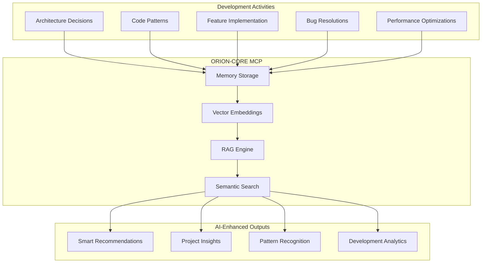
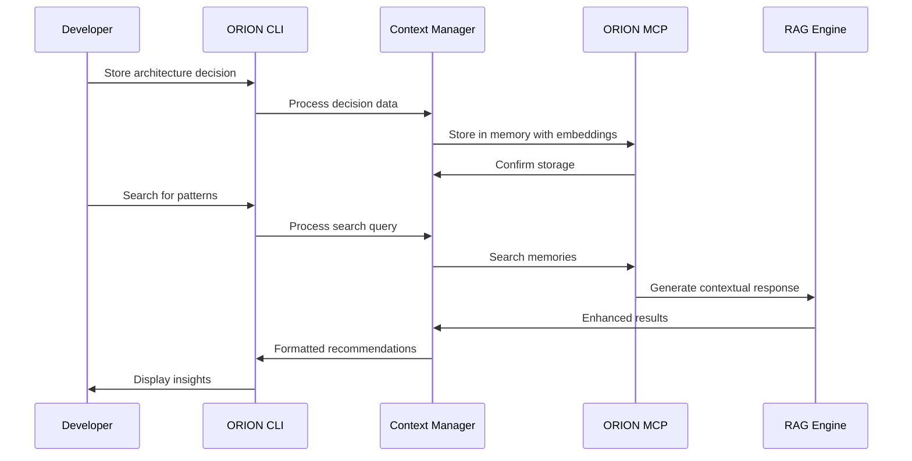

# 🤖 ORION-CORE Enhanced Development Workflow

## Overview

This project leverages ORION-CORE's MCP (Model Context Protocol) for extended memory and RAG capabilities throughout the development lifecycle, creating an AI-enhanced development experience.

## 🧠 ORION-CORE MCP Integration

### Core Capabilities
- **Extended Memory**: Store and retrieve development context across sessions
- **RAG (Retrieval-Augmented Generation)**: Intelligent context-aware recommendations
- **Vector Search**: Semantic search across all development artifacts
- **Pattern Recognition**: Identify reusable patterns and anti-patterns
- **Analytics & Insights**: AI-powered project analytics and recommendations

### Development Context Storage


## 🛠️ ORION Development Tools

### Command Line Interface
We've created a comprehensive CLI tool that integrates with ORION-CORE MCP:

```bash
# Initialize project in ORION-CORE memory
npm run orion:init

# Store architecture decisions
npm run store:arch -- \\
  --title "Use Next.js 14 App Router" \\
  --problem "Need modern React framework for performance" \\
  --decision "Adopt Next.js 14 with App Router" \\
  --rationale "Better performance, SSR, and developer experience"

# Store code patterns
npm run store:pattern -- \\
  --name "ORION Vector Search Hook" \\
  --description "React hook for vector similarity search" \\
  --use-case "Product recommendation components" \\
  --code "const useVectorSearch = (query) => { ... }" \\
  --orion-related

# Store ORION integrations
npm run store:integration -- \\
  --feature "Visual Search" \\
  --type "vector-search" \\
  --implementation "Image embeddings with CLIP model" \\
  --services "embeddings,vector-search"

# Store feature implementations
npm run store:feature -- \\
  --name "Dynamic Content Feed" \\
  --user-story "As a user, I want to see a personalized art feed" \\
  --approach "Infinite scroll with AI curation" \\
  --orion-integration "Memory-based personalization"

# Search development context
npm run orion:search "vector search implementation"
npm run orion:search "performance optimization patterns"
npm run orion:search "ORION integration best practices"

# Get project analytics
npm run orion:analytics

# Check system health
npm run orion:health-dev
```

### Context Categories

#### 1. Architecture Decisions
Store high-level technical decisions with rationale:
- Technology choices
- Design patterns
- Integration strategies
- Performance trade-offs

#### 2. Code Patterns
Reusable implementation patterns:
- React components
- API integration patterns
- ORION-CORE usage patterns
- Performance optimizations

#### 3. ORION Integrations
Document ORION-CORE specific implementations:
- Vector search usage
- Embedding generation
- Memory management
- RAG implementations

#### 4. Feature Implementations
Complete feature documentation:
- User stories
- Technical approach
- Components involved
- Testing strategy

#### 5. Performance Optimizations
Track performance improvements:
- Before/after metrics
- Optimization techniques
- Tools used
- Lessons learned

## 🔍 RAG-Enhanced Development

### Intelligent Code Assistance
```javascript
// Example: ORION-enhanced development workflow
const devContext = new DevelopmentContextManager();

// Store implementation context
await devContext.storeFeatureImplementation({
  name: "AI-Powered Product Recommendations",
  userStory: "Users receive personalized product suggestions",
  approach: "ORION-CORE vector search with user behavior analysis",
  orionIntegration: "Vector embeddings + memory-based personalization"
});

// Search for relevant patterns
const context = await devContext.searchDevelopmentContext(
  "recommendation system implementation"
);

// Get AI-powered insights
const insights = context.insights;
const recommendations = context.recommendations;
```

### Smart Documentation
- **Context-Aware**: Documentation that understands current development context
- **Pattern Recognition**: Automatically suggest related patterns and solutions
- **Best Practice Recommendations**: AI-powered suggestions based on stored knowledge
- **Anti-Pattern Detection**: Warn about potential issues based on historical data

## 📊 AI-Powered Analytics

### Development Velocity Tracking
```bash
# Get comprehensive project analytics
npm run orion:analytics

# Example output:
✅ Project Analytics Generated

🚀 Development Velocity: 8.5/10
🤖 ORION Adoption Rate: 85%
📈 Code Quality Trend: Improving
📚 Knowledge Coverage: 78%

🎯 Project Recommendations:
• Increase ORION-CORE integration in search features
• Document more code patterns for reuse
• Focus on performance optimization patterns
```

### Insight Categories
- **ORION Adoption**: How effectively we're using ORION-CORE features
- **Pattern Reuse**: Identification of reusable code patterns
- **Knowledge Gaps**: Areas lacking documentation or context
- **Performance Trends**: Performance optimization patterns and results
- **Technical Debt**: Areas needing refactoring or improvement

## 🔄 Workflow Integration

### Daily Development Cycle
1. **Morning**: Check ORION analytics for insights and recommendations
2. **Development**: Use `orion:search` to find relevant patterns and solutions
3. **Implementation**: Store new patterns and decisions as you code
4. **Evening**: Review and document feature implementations

### Code Review Process
1. **Before Review**: Search for similar implementations and patterns
2. **During Review**: Document new patterns discovered
3. **After Review**: Store lessons learned and best practices

### Sprint Planning
1. **Planning**: Search for similar features and complexity estimates
2. **Implementation**: Use stored patterns and ORION integrations
3. **Retrospective**: Analyze development velocity and pattern usage

## 🎯 Best Practices

### Effective Context Storage
```bash
# Be specific and searchable
npm run store:pattern -- \\
  --name "ORION Vector Search with Caching" \\
  --description "Cached vector search with Redis layer" \\
  --category "performance" \\
  --tags "caching,vector-search,redis"

# Include ORION-specific details
npm run store:integration -- \\
  --feature "Real-time Recommendations" \\
  --services "vector-search,memory,embeddings" \\
  --performance "Sub-second response time,Caching layer"
```

### Effective Searching
```bash
# Use semantic search for concepts
npm run orion:search "user preference learning patterns"

# Search by technology
npm run orion:search "Next.js performance optimization"

# Search by ORION features
npm run orion:search "vector similarity implementation"

# Search by problem domain
npm run orion:search "real-time feed optimization"
```

### Context Categorization
- **Tag Consistently**: Use consistent tags across similar contexts
- **Include Metadata**: Add complexity, impact, and technology information
- **Link Related Items**: Reference related patterns and decisions
- **Update Regularly**: Keep context current with implementation changes

## 🚀 Advanced Features

### RAG-Enhanced Documentation
```javascript
// Auto-generate documentation with ORION context
const ragDocs = new RAGDocumentationGenerator();

// Generate feature documentation with AI insights
const featureDocs = await ragDocs.generateFeatureDoc({
  feature: "Dynamic Content Feed",
  includePatterns: true,
  includeOrionIntegration: true,
  includePerformanceData: true
});
```

### Intelligent Code Generation
```javascript
// Generate boilerplate with ORION integration
const codeGen = new OrionCodeGenerator();

const component = await codeGen.generateComponent({
  type: "ProductCard",
  orionFeatures: ["vector-search", "recommendations"],
  patterns: ["cached-search", "motion-animations"]
});
```

### Predictive Analytics
- **Velocity Prediction**: Predict development time based on historical patterns
- **Quality Prediction**: Identify potential quality issues before they occur
- **Pattern Recommendations**: Suggest optimal patterns for new features
- **Integration Opportunities**: Identify where ORION-CORE can add value

## 🔧 System Architecture

### ORION-CORE MCP Integration
```javascript
// Development Context Manager Architecture
class DevelopmentContextManager {
  // Core MCP operations
  async storeContext(content, metadata)
  async searchContext(query, options)
  async getProjectInsights()

  // Specialized storage methods
  async storeArchitectureDecision(decision)
  async storeCodePattern(pattern)
  async storeOrionIntegration(integration)
  async storeFeatureImplementation(feature)

  // AI-enhanced retrieval
  async searchDevelopmentContext(query)
  async generateProjectAnalytics()
  async getSmartRecommendations(context)
}
```

### Data Flow


## 📈 Success Metrics

### Quantitative Metrics
- **Context Storage Rate**: Number of contexts stored per sprint
- **Search Usage**: Frequency of context searches
- **Pattern Reuse**: How often stored patterns are referenced
- **ORION Adoption**: Percentage of features using ORION-CORE

### Qualitative Metrics
- **Developer Velocity**: Faster development through context reuse
- **Code Quality**: Improved quality through pattern consistency
- **Knowledge Retention**: Better knowledge preservation across team
- **Decision Quality**: Better-informed architectural decisions

## 🎓 Training & Onboarding

### New Developer Onboarding
1. **ORION Introduction**: Understanding ORION-CORE capabilities
2. **CLI Training**: Hands-on practice with development tools
3. **Context Storage**: Best practices for documenting work
4. **Search Techniques**: Effective context search strategies

### Continuous Learning
- **Weekly ORION Reviews**: Team sessions on ORION usage patterns
- **Pattern Sharing**: Regular sharing of effective code patterns
- **Analytics Reviews**: Monthly analysis of development insights
- **Tool Evolution**: Continuous improvement of ORION integration

---

**This workflow represents a new paradigm in AI-enhanced development, where ORION-CORE MCP provides extended memory and intelligence throughout the entire development lifecycle.**